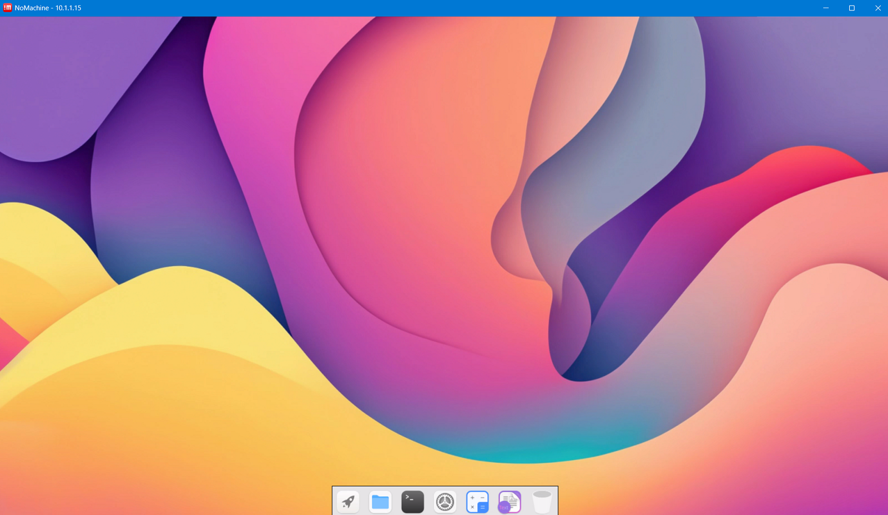
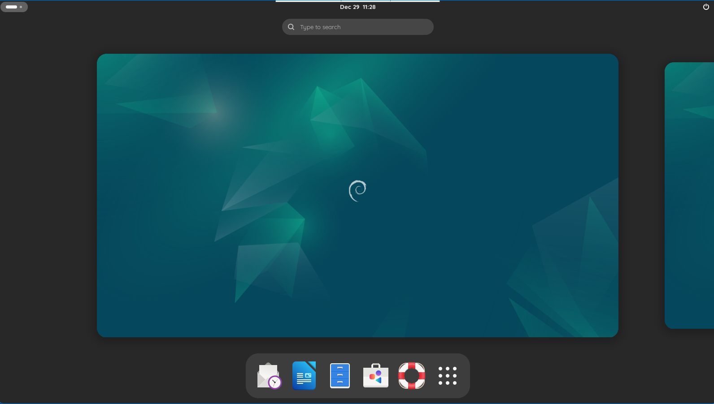
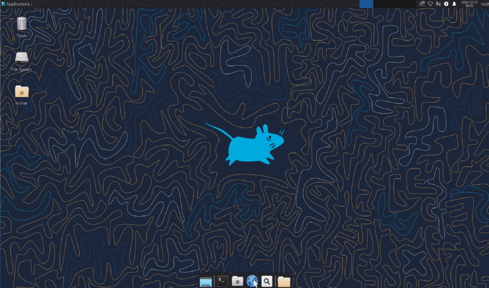
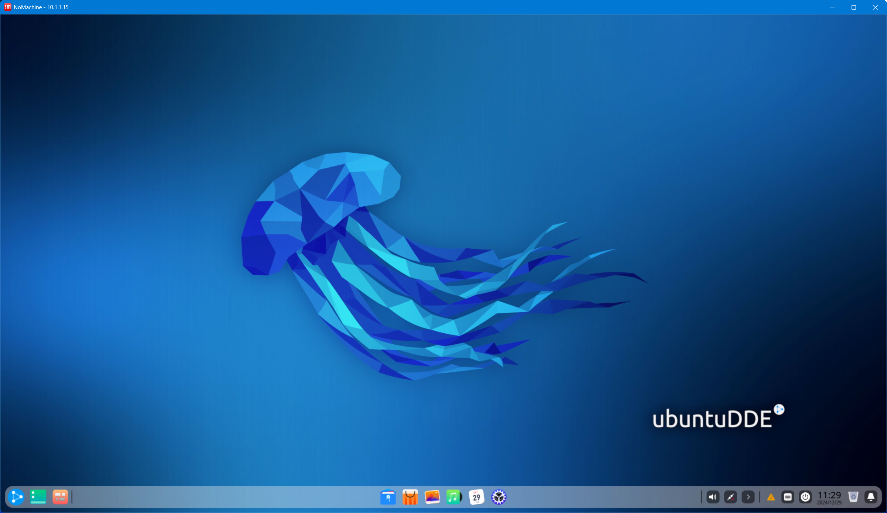
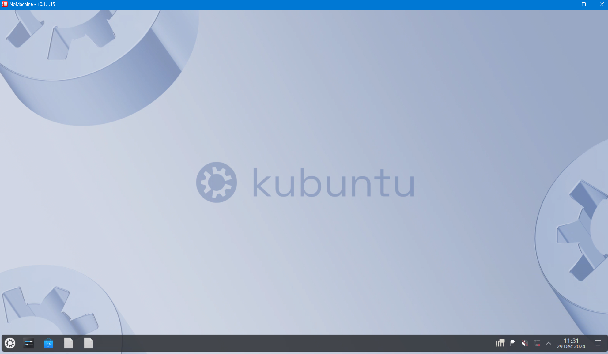

## RD Docker: Docker Support Remote Desktop Protocols

## 支持多种远程桌面协议连接带有桌面环境的Docker镜像

RDPDocker是一个带有X11个和桌面环境的Docker镜像构建和容器创建工具，支持创建Ubuntu、Debian、ArchLinux、Fedora系统，支持Lingmo、GNOME、Xfce4、X11、SSH等环境。同时，允许用户通过NoMachine、RDP、VNC、SSH等方式远程访问容器。本工具以非虚拟化和极低开销的情况下，实现了多用户共享一台主机的办法，同时创建极快，随用随开，并且只占用内存、磁盘极少的空间，只需要主机安装Docker即可，支持无桌面的Linux服务器、WSL2、LXC、安卓手机运行。

RDPDocker is a Docker image building and container creation tool with X11 and desktop environments, supporting the creation of Ubuntu, Debian, Arch Linux, Fedora systems, Lingmo, GNOME, Xfce4, X11, SSH and other environments. Meanwhile, users are allowed to remotely access the container through methods such as NoMachine, RDP, VNC, SSH, etc. This tool enables multiple users to share a host without virtualization and at extremely low cost. It is also very fast to create, can be used and opened at any time, and only occupies minimal memory and disk space. Docker only needs to be installed on the host. Supports running on headless Linux servers desktop, WSL2, LXC, and Android phones .

## Images / 镜像概览

### Intros / 镜像介绍

|  #   | Desktop Env | Introduction                                                 | Ubuntu | Debian | Arch | Fedora |
| :--: | :---------: | :----------------------------------------------------------- | :----: | :----: | :--: | :----: |
|  1   |   Server    | 无GUI和桌面，仅用于 SSH 远程连接使用<br/>No GUI and DE, only used for SSH connect. |   ✔️    |   ✔️    |  ✔️   |   ✔️    |
|  2   |   Lingmo    | 一个拥有高效和优美GUI 的现代桌面环境 <br/>Lingmo is a DE with efficient and great UI |   ✔️*   |   ✔️*   |  ❌   |   ❌    |
|  3   |    GNOME    | Linux常用图形的桌面环境, 功能齐全方便<br/>DE for commonly used graphics on Linux |   ✔️    |   ✔️    |  ✔️   |   ✔️    |
|  4   |   Xfce4L    | 一个非常轻量, 简洁易用的Linux桌面环境<br/>A lightweight & easy DE for UNIX-like OS. |   ✔️    |   ✔️    |  ✔️   |   ✔️    |
|  5   |     DDE     | 深度科技自主开发的美观易用的桌面环境<br/>主要由桌面、启动器、任务栏、控制中心<br/>窗口管理器等组成，预装了深度特色应用 |   ✔️    |   ✔️    |  ✔️   |   ✔️    |
|  6   |   Plasma    | 您可以使用*Plasma 桌面*环境轻松浏览网页<br/>与同事、朋友和家人保持联系，管理文件<br/>欣赏音乐和视频，并发挥创意和提高效率 |   ✔️    |   ✔️    |  ✔️   |   ✔️    |
|  0   |   X11GUI    | X11桌面基础环境集成远程桌面(构建专用)<br>X11 Desktop Basic Env (For build DE only.) |   ✔️    |   ✔️    |  ✔️   |   ✔️    |


### Support DE / 各个系统桌面支持情况

| 系统名称<br/>System Name | 系统版本<br/>System Version | Server | Lingmo | GNOME | Xfce 4 |   DDE   | Plasma | X11 GUI |
| :----------------------: | :-------------------------: | :----: | :----: | :---: | :----: | :-----: | :----: | :-----: |
|          Ubuntu          |            24.04            |   ✔️    |   ✔️    | ✔️(1)  |   ✔️    |   ❌**   |   ✔️    |    ✔️    |
|          Ubuntu          |            22.04            |   ✔️    |   /    |   ✔️   |   ✔️    | ✔️DDE(4) |   ✔️    |    ✔️    |
|          Debian          |            13.00            |   ✔️    |   /    | ✔️(1)  |   ✔️    | ✔️(GXDE) |  ✔️(2)  |    ✔️    |
|          Debian          |            12.00            |   ✔️    |  ✔️(4)  | ✔️(1)  |   ✔️    | ✔️(GXDE) |  ✔️(2)  |    ✔️    |
|          ArchOS          |            devel            |   ✔️    |   /    |  ✔️*   |   ✔️*   |   ✔️*    |   ✔️*   |    ✔️    |
|          Fedora          |            40.00            |   ✔️    |   /    | ✔️(1)  |  ✔️(3)  |    ✔️    |   ✔️    |    ✔️    |

*：尚未测试；**：桌面源不支持；/：尚无支持计划；

Ubuntu 20.04和Debian 11已不再提供更新支持，仅保留给之前的用户使用

### Known Issues / 一些已知的问题

- (1)部分GNOME系统VNC连不上，或者桌面首次打开会报错，点击确认后黑屏，解决办法
  - 登录到docker内部bash：`docker exec -it <DockerName> bash`
  - 执行：`export DISPLAY=:9 &&export $(dbus-launch)`
  - 执行：`nohup gnome-session & `
- (2)部分KDE Plasma环境，无法通过VNC或者RDP连接，暂时无法解决
- (3)部分Xfce 4环境，只能通过root帐号登录，非root需要root授权
- (4)部分Deepin DE环境，NoMachine无法点击登录按钮，可以绕过：
  - 在登录界面，点击关机按钮，但不要确认关机
  - 按下键盘的ESC键，你会发现可以输入密码了
- (5)部分Lingmo系统dock无法加载，或者只能通过NoMachine连接
- (GXDE)使用的第三方GXDE源替代Deepin官方源

## Desktop 桌面展示

### Lingmo



### GNOME



### Xfce4 Lite



### Deepin DE



### KDE Plasma



## Usages 使用方法

### Clone Git 克隆镜像

```
git clone https://github.com/PIKACHUIM/RDDocker.git
cd X11Docker && chmod +x ./Manager.sh && bash  ./Manager.sh
```
### Run OCIs 运行容器

- 您将看到这个界面(You will see this interface)：

- 输入`n`然后回车进入创建菜单(Enter `n` and press enter to enter the create menu)

  ```
     ┌──────────────────────────────────────────────────────────────────────┐
     │          Pikachu Docker Image Build and Container Setup Tool         │
     │                     Last Updated MAR 31 / 2023                       │
     │            Copyright © 2023 Pikachu, All Rights Reserved             │
     └──────────────────────────────────────────────────────────────────────┘
  
     ==================================Menu==================================
     --------------------------- Container Manage ---------------------------
            [n] [Created] Create a new docker container from an image
            [l] [Display] Display all docker containers in the system
            [s] [Started] Start your docker container already created
            [t] [Pausing] Pause your docker container already running
     -NOTE- [r] [Restart] Restart your docker container which ctarted
     *WARN* [K] [Killall] Stop your docker container which is running
     *WARN* [D] [Deleted] Select and delete your docker container now
     ----------------------------- Image Manage -----------------------------
     -NOTE- [b] [ Build ] Build your docker image from the DockerFile
     *WARN* [C] [ Clean ] Clean all unuse images and untag image file
     *WARN* [P] [ Prune ] Prune system(all unuse images & containers)
     ------------------------------------------------------------------------
            [q] [ Exit~ ] Do nothing, just exit this script! Byebye~~
     ========================================================================
  
     Choose Operation Type Number(*): 
  ```

- 输入数字选择容器操作系统(Enter numbers to select container operating system)

  ```
     ============================Available System============================
     [1]Ubuntu [√ Server /√ CuteOS /√ KDE /√ GNOME /√ DDE /√ OpenBox /√ xfce]
     [2]Debian [√ Server /√ CuteOS /√ KDE /√ GNOME /√ DDE /× OpenBox /× xfce]
     [3]ArchOS [√ Server /√ CuteOS /× KDE /× GNOME /× DDE /× OpenBox /× xfce]
     ========================================================================
  
     Choose Platforms Type Number(1): 
  ```
  
- 输入数字选择操作系统版本(Enter the number to select the operating system version)

  ```
     ============================Available Version===========================
        [1] 24.04 Jammy Jellyfish  [ √ Now Recommend / Support Until 2029 ]  
        [2] 22.04 Jammy Jellyfish  [ √ Now Recommend / Support Until 2027 ]  
        [3] 20.04 Focal Fossa      [ × Not Recommend / Support Until 2025 ]  
     ========================================================================
  
     Choice System Version Number(1): 
  ```
  
- 输入数字选择桌面环境系统（Enter numbers to select desktop environment system）

  ```
     ============================Available Desktop===========================
        [1] Servers NoGraphic  [ √ SSH / × GUI APPs / × NoMachine / × VNC ]  
        [2] Desktop Lingmo DE  [ √ SSH / √ GUI APPs / √ NoMachine / √ VNC ]  
        [3] Desktop Gnome GUI  [ √ SSH / √ GUI APPs / √ NoMachine / √ VNC ]  
        [4] Desktop Xfce4 GUI  [ √ SSH / √ GUI APPs / √ NoMachine / √ VNC ]  
        [0] X11 GUI Basic ENV  [ √ SSH / √ GUI APPs / √ NoMachine / √ VNC ]  
     ========================================================================
  
     Choose GUI Environments Type(1): 
  
  ```
  
- 选择是否使用宿主机的显卡（Choose whether to use the graphics card of the host computer）

- 注意：必须是英伟达独立显卡才可以使用(Attention: It must be an NVIDIA discrete graphics card)

  ```
     =============================Graphics Cards=============================
        [A] All Graphics Cards [Using All Graphics of Current Local Syatem]  
        [N] Disabled All Cards [Don't Use Graphics of Current Local Syatem]  
     ========================================================================
     Choose Graphics Cards Enable(N): 
  
  ```
  
- 输入唯一的两位数ID(比如`01`) (Enter a unique two digit ID to distinguish like `01`)

- 映射端口，格式为`主机端口:容器端口`，不需要或者完成映射，直接输入`q`即可退出

- Map ports in the format of `host port: container port`, enter `q` to exit port map.

  ```
     ===========================Config Port Mapping==========================
     Enter Docker ID(Length=2 Like 01): 01
     ===========================Configure Port Map===========================
     Note: !!!Enter 'q' to Finish Port Mapping Input!!!
     Enter Port Mapping(host_port:oci_port): q
  ```
  
- 确认信息，输入`y`确认创建 (Confirm information, enter `y` to confirm creation)

  ```
     ===========================Container Info===============================
     Port Mapping: 
           10101-10121:10101-10121 
           10123-10139:10123-10139 
           10142-10199:10142-10199
     SSHD Porting: 10122
     NXD Services: 10140
     Docker  Name: **************
     System  Name: ubuntu
     System  Vers: 24.04
     Desktop Type: server
     ========================================================================
     Confirm to create the container? (y/n): 
  ```
  
- 创建完成后会输出容器访问信息：

  ```
  ──────────────────────────────────────────────────────────────────────
  Congratulations! Your Docker Container has been Created Successfully! 
  ----------------------------------------------------------------------
                   Container *******************                    
                   OSSystem: ubuntu 24.04            
  ----------------------------------------------------------------------
                   NXServer: *******************   
                   IPV4Host: *******************  
                   IPV6Host: *******************    
                   HostName: *******************    
  ----------------------------------------------------------------------
                   Username: root                         
                   Password: *******************                     
                   Username: user                         
                   Password: *******************                     
  ----------------------------------------------------------------------
                                                                        
  Port Mapping Details:
         
           10101-10121:10101-10121 
           10123-10139:10123-10139 
           10142-10199:10142-10199
                                                                        
  Container Volume Map:                                                 
      Host: /home/ocis/OCI01 -> OCI: /home/user
                                                                        
  ----------------------------------------------------------------------
                                                                        
  SSHLogin Private Key:
  *******************
                                                                        
  SSHLogin Public Key:
  *******************
                                                                        
  ----------------------------------------------------------------------
  Note: Saved password in ./Backups/passwd.conf, please delete if need! 
  For any questions or suggestions, please visit:                       
                   https://github.com/PIKACHUIM/DockerFiles             
  ──────────────────────────────────────────────────────────────────────
  ======================= Enter to back to menu ========================
  ```
  
  

### Connect 使用容器

1. 下载[NoMachine](https://www.nomachine.com/)，然后安装 /   Download [NoMachine](https://www.nomachine.com/), Then install

2. 打开NoMachine，选择左上角的`Add`，添加远程桌面

   Open NoMachine, select 'Add' and add remote desktop

   > host：您docker所在主机地址 / Your Docker host address
   >
   > port：上面列出的端口，为`1`+`ID`+`40`，例如`ID`为`01`，则端口为`10140`
   >
   > The ports listed above.  ` 1 `+` ID `+` 40 `. For example, if ` ID ` is ` 01 `, then the port is `10140 `

3. 然后您可以连接，用户名可以是`root`或者`user`，密码是上面列出`Password: `后面内容

   Then you can connect, the username can be 'root' or 'user', and the password is listed above

### Q&A 错误排查

1. 无法连接远程服务器 / Unable to connect to remote server

   - 检查服务器IP地址、防火墙端口是否打开

     Check if the server IP address and firewall are open

   - 检查Docker是否安装、容器是否超过启动

     Check if Docker is installed and if the container has exceeded startup time

   - 检查NoMachine服务是否正常运行

     Check if the NoMachine service is running properly

     在主机上执行：`docker exec -it 容器名称 bash -c "ps -ef | grep nxserve"`

     Execute on the host: `docker exec -it Name bash -c "ps -ef | grep nxserve"`

     正常情况输出(Normal output)：

     ```
     nx ...... /usr/NX/bin/nxserver.bin root 1898 --daemon
     nx ...... /usr/NX/bin/nxserver.bin -c /etc/NX/nxserver --login -H 9
     ```

   - 如果没有，可以尝试运行(If not, you can try running it)

     ```
     docker exec -it Name bash -c "/etc/NX/nxserver --startup"
     ```

2. 没有桌面/黑屏/白屏/卡死 / No desktop/black screen/white screen/stuck

   - 在主机上执行：Execute on the host: 

     ```
     docker exec -it <Name> bash -c "ps -ef | grep session"
     ```

   - 将输出内容提交Issue / Submit the output content to Issue

     [New Issue · PIKACHUIM/RDPDocker (github.com)](https://github.com/PIKACHUIM/RDPDocker/issues/new)

