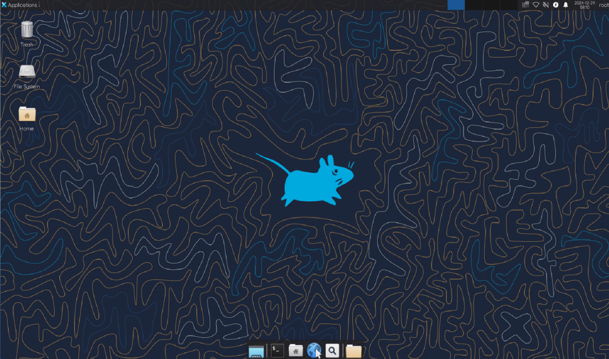
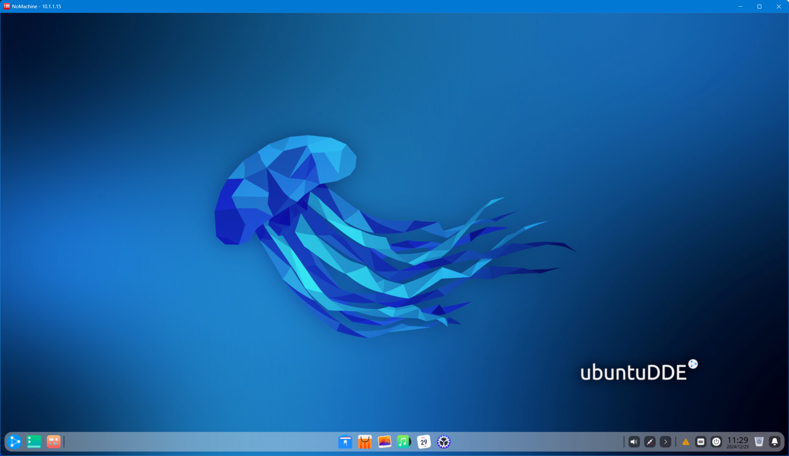

# EasyDesk / RDDockerRepo

**EN** | [中文](#chinese)

RDPDocker是一个带有X11个和桌面环境的Docker镜像构建和容器创建工具，支持创建Ubuntu、Debian、ArchLinux、Fedora系统，支持Lingmo、GNOME、Xfce4、X11、SSH等环境。同时，允许用户通过NoMachine、RDP、VNC、SSH等方式远程访问容器。本工具以非虚拟化和极低开销的情况下，实现了多用户共享一台主机的办法，同时创建极快，随用随开，并且只占用内存、磁盘极少的空间，只需要主机安装Docker即可，支持无桌面的Linux服务器、WSL2、LXC、安卓手机运行。

RDPDocker is a Docker image building and container creation tool with X11 and desktop environments, supporting the creation of Ubuntu, Debian, Arch Linux, Fedora systems, Lingmo, GNOME, Xfce4, X11, SSH and other environments. Meanwhile, users are allowed to remotely access the container through methods such as NoMachine, RDP, VNC, SSH, etc. This tool enables multiple users to share a host without virtualization and at extremely low cost. It is also very fast to create, can be used and opened at any time, and only occupies minimal memory and disk space. Docker only needs to be installed on the host. Supports running on headless Linux servers desktop, WSL2, LXC, and Android phones .

## Features

- Pre-built images for Debian, Ubuntu, Alpine, Fedora — pull and run in seconds
- Multiple desktop environments: GNOME, Xfce4, KDE Plasma, GXDE, Niri Wayland
- Built-in remote access: NoMachine NX (4000), VNC (5900), XRDP (3389), SSH (22)
- Multi-arch: `linux/amd64` and `linux/arm64`
- `easydesk` CLI + REST API to manage Docker/Podman/LXC/LXD containers uniformly

|  #   | Desktop Env | Introduction                                                 | Ubuntu | Debian | Alpine | Fedora |
| :--: | :---------: | :----------------------------------------------------------- | :----: | :----: | :----: | :----: |
|  1   |   Server    | 无GUI和桌面，仅用于 SSH 远程连接使用<br/>No GUI and DE, only used for SSH connect. |   ✔️    |   ✔️    |   ✔️    |   ✔️    |
|  2   |   Lingmo    | 一个拥有高效和优美GUI 的现代桌面环境 <br/>Lingmo is a DE with efficient and great UI |   ✔️*   |   ✔️*   |   ❌    |   ❌    |
|  3   |    GNOME    | Linux常用图形的桌面环境, 功能齐全方便<br/>DE for commonly used graphics on Linux |   ✔️    |   ✔️    |   ✔️    |   ✔️    |
|  4   |   Xfce4L    | 一个非常轻量, 简洁易用的Linux桌面环境<br/>A lightweight & easy DE for UNIX-like OS. |   ✔️    |   ✔️    |   ✔️    |   ✔️    |
|  5   |    DDE15    | 深度科技自主开发的美观易用的桌面环境<br/>主要由桌面、启动器、任务栏、控制中心<br/>窗口管理器等组成，预装了深度特色应用 |   ✔️    |   ✔️    |   ❌    |   ✔️    |
|  6   |   Plasma    | 您可以使用*Plasma 桌面*环境轻松浏览网页<br/>与同事、朋友和家人保持联系，管理文件<br/>欣赏音乐和视频，并发挥创意和提高效率 |   ✔️    |   ✔️    |   ✔️    |   ✔️    |
|  0   |   X11GUI    | X11桌面基础环境集成远程桌面(构建专用)<br>X11 Desktop Basic Env (For build DE only.) |   ✔️    |   ✔️    |   ✔️    |   ✔️    |

| OS | Version | Server | X11GUI | GNOME3 | Xfce4L | Plasma | GXDeOS | Nirios | Arch |
|----|---------|:------:|:------:|:------:|:------:|:------:|:------:|:------:|------|
| Debian | 12 / 13 | ✅ | ✅ | ✅ | ✅ | ✅ | ✅ | ✅ | amd64 / arm64 |
| Ubuntu | 24.04 / 26.04 | ✅ | ✅ | ✅ | ✅ | ✅ | - | ✅ | amd64 / arm64 |
| Alpine | 3.19 / 3.20 | ✅ | ✅ | - | ✅ | - | - | - | amd64 / arm64 |
| Fedora | 40 / 41 | ✅ | ✅ | ✅ | ✅ | ✅ | - | ✅ | amd64 / arm64 |

## Quick Start

### Support DE / 各个系统桌面支持情况

| 系统名称<br/>System Name | 支持协议<br/>Support Connector | 系统版本<br/>System Version | Server | Lingmo | GNOME | Xfce 4 |  DDE15  | Plasma | X11 GUI |
| :----------------------: | :----------------------------: | :-------------------------: | :----: | :----: | :---: | :----: | :-----: | :----: | :-----: |
|          Ubuntu          |      Nomachine、VNC、RDP       |            24.04            |   ✔️    |   ✔️    | ✔️(1)  |   ✔️    |   ❌**   |   ✔️    |    ✔️    |
|          Ubuntu          |      Nomachine、VNC、RDP       |            22.04            |   ✔️    |   /    |   ✔️   |   ✔️    | ✔️DDE(4) |   ✔️    |    ✔️    |
|          Debian          |      Nomachine、VNC、RDP       |            13.00            |   ✔️    |   /    | ✔️(1)  |   ✔️    | ✔️(GXDE) |  ✔️(2)  |    ✔️    |
|          Debian          |      Nomachine、VNC、RDP       |            12.00            |   ✔️    |  ✔️(4)  | ✔️(1)  |   ✔️    | ✔️(GXDE) |  ✔️(2)  |    ✔️    |
|          Alpine          |            VNC、RDP            |           3.21.3            |   ✔️    |   /    |  ✔️*   |   ✔️*   |    /    |   ✔️*   |    ✔️    |
|          Alpine          |            VNC、RDP            |           3.20.6            |   ✔️    |   /    |   ✔️   |   ✔️    |    /    |   ✔️    |    ✔️    |
|          Fedora          |      Nomachine、VNC、RDP       |            42.00            |   ✔️    |   /    | ✔️(1)  |  ✔️(3)  |    ✔️    |   ✔️    |    ✔️    |
|          Fedora          |      Nomachine、VNC、RDP       |            42.00            |   ✔️    |   /    |  ✔️*   |   ✔️*   |   ✔️*    |   ✔️*   |   ✔️*    |

*：尚未充分测试桌面实际情况；**：有支持计划，但桌面源不支持；/：尚无该桌面支持计划;

备注：Ubuntu 20.04、Debian 11、ArchLinux已不再提供更新支持，仅保留给之前的用户使用

### Known Issues / 一些已知的问题

- (1)部分GNOME系统VNC连不上，或者桌面首次打开会报错，点击确认后黑屏，解决办法
  - 登录到docker内部bash：`docker exec -it <DockerName> bash`
  - 执行：`export DISPLAY=:9 &&export $(dbus-launch)`
  - 执行：`nohup gnome-session & `
- (2)部分KDE Plasma环境，无法通过VNC或者RDP连接，暂时无法解决
- (3)部分Xfce 4环境，只能通过root帐号登录，非root需要root授权
- (4)部分Deepin DE环境，NoMachine无法点击登录按钮，可以绕过：
  - 在登录界面，点击关机按钮，但不要确认关机
  - 按下键盘的ESC键，你会发现可以输入密码了
- (5)部分Lingmo系统dock无法加载，或者只能通过NoMachine连接
- (GXDE)使用的第三方GXDE源替代Deepin官方源

## Desktop 桌面展示

### Lingmo


### GNOME


### Xfce4 Lite



### Deepin DE



### KDE Plasma


## Usages 使用方法

### Clone Git 克隆镜像

```bash
curl -fsSL https://raw.githubusercontent.com/PIKACHUIM/RDDockerRepo/master/easydesk/install.sh | bash
```

**Step 2** — Configure the container engine:

```bash
easydesk conf set engine docker
easydesk conf set token your_secret_token
```

**Step 3** — Create your first desktop container:

```bash
easydesk desk new pikachuim/debian:12-xfce4l \
  --name my-desktop \
  --port 4000:4000 \
  --port 5900:5900 \
  --port 2222:22
```

Then connect with NoMachine to `host:4000`, VNC to `host:5900`, or SSH to `host:2222`.

Full documentation: [doc/](doc/)

---

<a name="chinese"></a>

# EasyDesk / RDDockerRepo（中文）

开箱即用的桌面容器环境。基于 Docker/Podman/LXC/LXD，一键构建带远程桌面的 Linux 容器。

## 功能特点

- 预构建镜像覆盖 Debian、Ubuntu、Alpine、Fedora，拉取即用
- 多桌面环境：GNOME、Xfce4、KDE Plasma、GXDE、Niri Wayland
- 内置远程访问：NoMachine NX（4000）、VNC（5900）、XRDP（3389）、SSH（22）
- 多架构：`linux/amd64` 和 `linux/arm64`
- `easydesk` 统一管理 Docker/Podman/LXC/LXD 的 CLI + REST API

## 快速开始

```bash
# 1. 安装 easydesk
curl -fsSL https://raw.githubusercontent.com/PIKACHUIM/RDDockerRepo/master/easydesk/install.sh | bash

# 2. 配置
easydesk conf set engine docker
easydesk conf set token your_token

# 3. 创建桌面容器
easydesk desk new pikachuim/debian:12-xfce4l \
  --name my-desktop \
  --port 4000:4000 --port 5900:5900 --port 2222:22
```

## 文档

完整文档请见 [doc/](doc/) 目录，本地预览：

```bash
cd doc && npm install && npm run docs:dev
```
