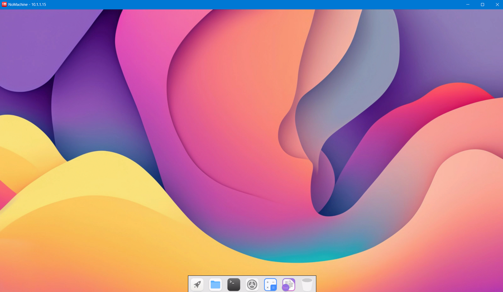
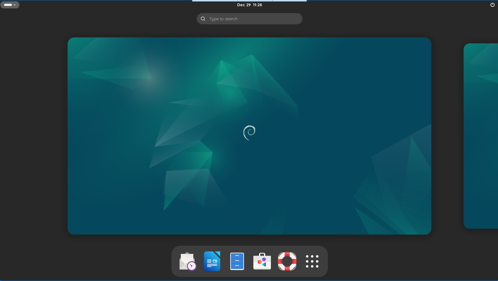
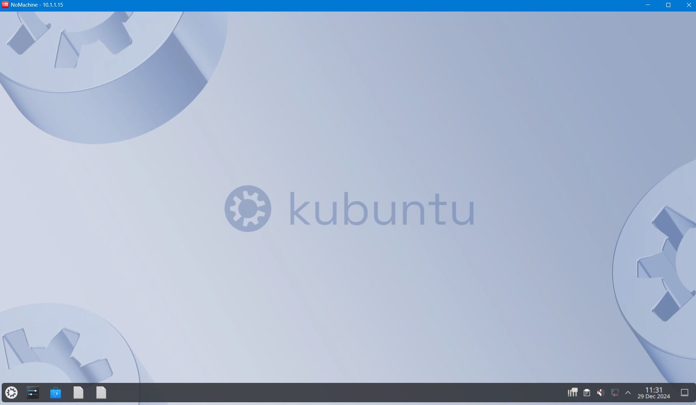

<div align="center">

<h1>🖥️ RDDocker</h1>

<p>开箱即用的桌面容器环境 · Ready-to-use Desktop Containers</p>

[](https://github.com/PIKACHUIM/RDDocker/actions)
[](LICENSE)
[](https://hub.docker.com/u/pikachuim)
[](#支持矩阵)

</div>

---

## 📖 简介

**RDDocker** 是一套带桌面环境的 Linux 容器镜像构建系统，配套管理工具 **deskcli**。

无需虚拟化，极低开销，创建秒级完成——在一台主机上运行多个独立的 Linux 桌面，通过 **NoMachine / VNC / XRDP** 远程连接使用。适用于：

- 在云服务器或裸机上快速开启一个可视化桌面工作环境
- 多人共享同一台主机，每人独立的桌面容器
- CI/CD 中需要桌面环境的自动化测试
- LXC / PVE 等无法直接运行桌面的环境

支持运行在 Linux 服务器、WSL2、PVE LXC（≥9.2）、Android（Termux + Docker）等平台。

---

## 🖼️ 桌面截图

<table>
<tr>
  <td align="center"><b>Lingmo DE</b><br/></td>
  <td align="center"><b>GNOME 3</b><br/></td>
</tr>
<tr>
  <td align="center"><b>Xfce4 Lite</b><br/></td>
  <td align="center"><b>KDE Plasma</b><br/></td>
</tr>
<tr>
  <td align="center" colspan="2"><b>Deepin DE</b><br/></td>
</tr>
</table>

---

## 📋 支持矩阵

### 操作系统 & 版本

| 系统 | 版本                          | 架构 |
|------|-----------------------------|------|
| **Debian** | 12 (bookworm) / 13 (trixie) | amd64 · arm64 |
| **Ubuntu** | 22.04 / 24.04 / 26.04       | amd64 · arm64 |
| **Alpine** | 3.23.4 / 3.24.1             | amd64 · arm64 |
| **Fedora** | 43 / 44                     | amd64 · arm64 |
| **ArchOS** | latest                      | amd64 |

### 桌面环境

| 桌面 | 简介                | Debian | Ubuntu | Fedora | Alpine | Arch Liunx |
|------|-------------------|:------:|:------:|:------:|:------:|:----:|
| **Server** | 纯 SSH，无图形界面       | ✅ | ✅ | ✅ | ✅ | ✅ |
| **X11GUI** | X11 基础层（含远程协议）    | ✅ | ✅ | ✅ | ✅ | ✅ |
| **GNOME3** | 功能完整的 GNOME 桌面    | ✅ | ✅ | ✅ | ✅ | ❌ |
| **Xfce4L** | 轻量、低资源占用          | ✅ | ✅ | ✅ | ✅ | ❌ |
| **Plasma** | 功能丰富的现代桌面         | ✅ | ✅ | ✅ | ✅ | ❌ |
| **Hyland** | Hyperland 桌面环境 | 🚧 | 🚧 | 🚧 | 🚧 | ❌ |
| **Nirios** | Niri Wayland 窗口管理 | 🚧 | 🚧 | 🚧 | ❌ | 🚧 |
| **Deepin** | 深度 DDE 桌面         | ✅ | ⚠️ | ✅ | ❌ | ✅ |
| **Lingmo** | Lingmo OS 桌面      | ✅ | ✅ | ❌ | ❌ | ❌ |

备注：
1. Ubuntu DDE（Deepin）仅支持 22.04，24.04 及 26.04 版本不支持
2. Alpine 和 Arch Linux 分别覆盖主流桌面，相互不重叠，且均暂不支持 Lingmo DE
3. HyperLand 和 Niri 属于实验性支持，使用 Wayland，暂不支持 RDP 方式连接到容器
4. Ubuntu 26.04 使用 GNOME 50，不再支持 X11，使用 Wayland，VNC 和 RDP 组件有差异

### 镜像速查

> 镜像同时发布至 Docker Hub（`pikachuim/<系统>:<版本>-<桌面>`）和 GHCR（`ghcr.io/pikachuim/<系统>:<版本>-<桌面>`），下表 GHCR 列去掉 `ghcr.io/` 前缀即为 Docker Hub 镜像名。

| 系统 | 版本 | 桌面 | GHCR 镜像名 | 备注 |
|------|------|------|------------|------|
| Debian | bookworm | server | `ghcr.io/pikachuim/debian:bookworm-server` | 纯 SSH，无图形界面 |
| Debian | bookworm | x11gui | `ghcr.io/pikachuim/debian:bookworm-x11gui` | X11 基础层 + NoMachine / VNC / XRDP |
| Debian | bookworm | gnome3 | `ghcr.io/pikachuim/debian:bookworm-gnome3` | GNOME 3 桌面 |
| Debian | bookworm | xfce4l | `ghcr.io/pikachuim/debian:bookworm-xfce4l` | Xfce4 轻量桌面 |
| Debian | bookworm | plasma | `ghcr.io/pikachuim/debian:bookworm-plasma` | KDE Plasma |
| Debian | bookworm | deepin | `ghcr.io/pikachuim/debian:bookworm-deepin` | 深度 DDE |
| Debian | bookworm | nirios | `ghcr.io/pikachuim/debian:bookworm-nirios` | Niri Wayland，实验性，仅 amd64 |
| Debian | bookworm | lingmo | `ghcr.io/pikachuim/debian:bookworm-lingmo` | Lingmo OS，仅 amd64 |
| Debian | bookworm | hyland | `ghcr.io/pikachuim/debian:bookworm-hyland` | Hyprland Wayland，实验性 |
| Debian | trixie | server | `ghcr.io/pikachuim/debian:trixie-server` | 纯 SSH，无图形界面 |
| Debian | trixie | x11gui | `ghcr.io/pikachuim/debian:trixie-x11gui` | X11 基础层 + NoMachine / VNC / XRDP |
| Debian | trixie | gnome3 | `ghcr.io/pikachuim/debian:trixie-gnome3` | GNOME 3 桌面 |
| Debian | trixie | xfce4l | `ghcr.io/pikachuim/debian:trixie-xfce4l` | Xfce4 轻量桌面 |
| Debian | trixie | plasma | `ghcr.io/pikachuim/debian:trixie-plasma` | KDE Plasma |
| Debian | trixie | deepin | `ghcr.io/pikachuim/debian:trixie-deepin` | 深度 DDE |
| Debian | trixie | nirios | `ghcr.io/pikachuim/debian:trixie-nirios` | Niri Wayland，实验性，仅 amd64 |
| Debian | trixie | lingmo | `ghcr.io/pikachuim/debian:trixie-lingmo` | Lingmo OS，仅 amd64 |
| Debian | trixie | hyland | `ghcr.io/pikachuim/debian:trixie-hyland` | Hyprland Wayland，实验性 |
| Ubuntu | 22.04 | server | `ghcr.io/pikachuim/ubuntu:22.04-server` | 纯 SSH，无图形界面 |
| Ubuntu | 22.04 | x11gui | `ghcr.io/pikachuim/ubuntu:22.04-x11gui` | X11 基础层 + NoMachine / VNC / XRDP |
| Ubuntu | 22.04 | deepin | `ghcr.io/pikachuim/ubuntu:22.04-deepin` | 深度 DDE，Ubuntu DDE 仅支持此版本 |
| Ubuntu | 24.04 | server | `ghcr.io/pikachuim/ubuntu:24.04-server` | 纯 SSH，无图形界面 |
| Ubuntu | 24.04 | x11gui | `ghcr.io/pikachuim/ubuntu:24.04-x11gui` | X11 基础层 + NoMachine / VNC / XRDP |
| Ubuntu | 24.04 | gnome3 | `ghcr.io/pikachuim/ubuntu:24.04-gnome3` | GNOME 3 桌面 |
| Ubuntu | 24.04 | xfce4l | `ghcr.io/pikachuim/ubuntu:24.04-xfce4l` | Xfce4 轻量桌面 |
| Ubuntu | 24.04 | plasma | `ghcr.io/pikachuim/ubuntu:24.04-plasma` | KDE Plasma |
| Ubuntu | 24.04 | deepin | `ghcr.io/pikachuim/ubuntu:24.04-deepin` | 深度 DDE |
| Ubuntu | 24.04 | nirios | `ghcr.io/pikachuim/ubuntu:24.04-nirios` | Niri Wayland，实验性，仅 amd64 |
| Ubuntu | 24.04 | lingmo | `ghcr.io/pikachuim/ubuntu:24.04-lingmo` | Lingmo OS，仅 amd64 |
| Ubuntu | 24.04 | hyland | `ghcr.io/pikachuim/ubuntu:24.04-hyland` | Hyprland Wayland，实验性 |
| Ubuntu | 26.04 | server | `ghcr.io/pikachuim/ubuntu:26.04-server` | 纯 SSH，无图形界面 |
| Ubuntu | 26.04 | x11gui | `ghcr.io/pikachuim/ubuntu:26.04-x11gui` | X11 基础层，Wayland，VNC/RDP 有差异 |
| Ubuntu | 26.04 | gnome3 | `ghcr.io/pikachuim/ubuntu:26.04-gnome3` | GNOME 50，Wayland，VNC/RDP 有差异 |
| Ubuntu | 26.04 | xfce4l | `ghcr.io/pikachuim/ubuntu:26.04-xfce4l` | Xfce4 轻量桌面 |
| Ubuntu | 26.04 | plasma | `ghcr.io/pikachuim/ubuntu:26.04-plasma` | KDE Plasma |
| Ubuntu | 26.04 | deepin | `ghcr.io/pikachuim/ubuntu:26.04-deepin` | 深度 DDE |
| Ubuntu | 26.04 | nirios | `ghcr.io/pikachuim/ubuntu:26.04-nirios` | Niri Wayland，实验性，仅 amd64 |
| Ubuntu | 26.04 | lingmo | `ghcr.io/pikachuim/ubuntu:26.04-lingmo` | Lingmo OS，仅 amd64 |
| Ubuntu | 26.04 | hyland | `ghcr.io/pikachuim/ubuntu:26.04-hyland` | Hyprland Wayland，实验性 |
| Fedora | 43 | server | `ghcr.io/pikachuim/fedora:43-server` | 纯 SSH，无图形界面 |
| Fedora | 43 | x11gui | `ghcr.io/pikachuim/fedora:43-x11gui` | X11 基础层 + NoMachine / VNC / XRDP |
| Fedora | 43 | gnome3 | `ghcr.io/pikachuim/fedora:43-gnome3` | GNOME 3 桌面 |
| Fedora | 43 | xfce4l | `ghcr.io/pikachuim/fedora:43-xfce4l` | Xfce4 轻量桌面 |
| Fedora | 43 | plasma | `ghcr.io/pikachuim/fedora:43-plasma` | KDE Plasma |
| Fedora | 43 | deepin | `ghcr.io/pikachuim/fedora:43-deepin` | 深度 DDE |
| Fedora | 43 | nirios | `ghcr.io/pikachuim/fedora:43-nirios` | Niri Wayland，实验性，仅 amd64 |
| Fedora | 43 | lingmo | `ghcr.io/pikachuim/fedora:43-lingmo` | Lingmo OS，仅 amd64 |
| Fedora | 43 | hyland | `ghcr.io/pikachuim/fedora:43-hyland` | Hyprland Wayland，实验性 |
| Fedora | 44 | server | `ghcr.io/pikachuim/fedora:44-server` | 纯 SSH，无图形界面 |
| Fedora | 44 | x11gui | `ghcr.io/pikachuim/fedora:44-x11gui` | X11 基础层 + NoMachine / VNC / XRDP |
| Fedora | 44 | gnome3 | `ghcr.io/pikachuim/fedora:44-gnome3` | GNOME 3 桌面 |
| Fedora | 44 | xfce4l | `ghcr.io/pikachuim/fedora:44-xfce4l` | Xfce4 轻量桌面 |
| Fedora | 44 | plasma | `ghcr.io/pikachuim/fedora:44-plasma` | KDE Plasma |
| Fedora | 44 | deepin | `ghcr.io/pikachuim/fedora:44-deepin` | 深度 DDE |
| Fedora | 44 | nirios | `ghcr.io/pikachuim/fedora:44-nirios` | Niri Wayland，实验性，仅 amd64 |
| Fedora | 44 | lingmo | `ghcr.io/pikachuim/fedora:44-lingmo` | Lingmo OS，仅 amd64 |
| Fedora | 44 | hyland | `ghcr.io/pikachuim/fedora:44-hyland` | Hyprland Wayland，实验性 |
| Alpine | 3.23.4 | server | `ghcr.io/pikachuim/alpine:3.23.4-server` | 纯 SSH，无图形界面 |
| Alpine | 3.23.4 | x11gui | `ghcr.io/pikachuim/alpine:3.23.4-x11gui` | X11 基础层 + NoMachine / VNC / XRDP |
| Alpine | 3.23.4 | gnome3 | `ghcr.io/pikachuim/alpine:3.23.4-gnome3` | GNOME 3 桌面 |
| Alpine | 3.23.4 | xfce4l | `ghcr.io/pikachuim/alpine:3.23.4-xfce4l` | Xfce4 轻量桌面 |
| Alpine | 3.23.4 | plasma | `ghcr.io/pikachuim/alpine:3.23.4-plasma` | KDE Plasma |
| Alpine | 3.23.4 | hyland | `ghcr.io/pikachuim/alpine:3.23.4-hyland` | Hyprland Wayland，实验性 |
| Alpine | 3.24.1 | server | `ghcr.io/pikachuim/alpine:3.24.1-server` | 纯 SSH，无图形界面 |
| Alpine | 3.24.1 | x11gui | `ghcr.io/pikachuim/alpine:3.24.1-x11gui` | X11 基础层 + NoMachine / VNC / XRDP |
| Alpine | 3.24.1 | gnome3 | `ghcr.io/pikachuim/alpine:3.24.1-gnome3` | GNOME 3 桌面 |
| Alpine | 3.24.1 | xfce4l | `ghcr.io/pikachuim/alpine:3.24.1-xfce4l` | Xfce4 轻量桌面 |
| Alpine | 3.24.1 | plasma | `ghcr.io/pikachuim/alpine:3.24.1-plasma` | KDE Plasma |
| Alpine | 3.24.1 | hyland | `ghcr.io/pikachuim/alpine:3.24.1-hyland` | Hyprland Wayland，实验性 |
| ArchOS | latest | server | `ghcr.io/pikachuim/archos:latest-server` | 纯 SSH，无图形界面 |
| ArchOS | latest | x11gui | `ghcr.io/pikachuim/archos:latest-x11gui` | X11 基础层 + NoMachine / VNC / XRDP |
| ArchOS | latest | deepin | `ghcr.io/pikachuim/archos:latest-deepin` | 深度 DDE |
| ArchOS | latest | nirios | `ghcr.io/pikachuim/archos:latest-nirios` | Niri Wayland，实验性，仅 amd64 |

### 远程访问协议

| 协议                | 端口   | 说明               |
|-------------------|------|------------------|
| **No Machine NX** | 4000 | NXD低延迟支持音频剪贴板    |
| **XVNC (x11vnc)** | 5900 | 任意通用VNC客户端可使用    |
| **XRDP (x11rdp)** | 3389 | Windows RDP远程桌面访问 |
| **OpenSSHServer** | 22   | 默认使用SSH命令进行访问    |

---

## 🚀 安装方式

### 方式一：使用 deskcli 管理工具（推荐）

```bash
# 一键安装 deskcli（需要 root）
curl -fsSL https://raw.githubusercontent.com/PIKACHUIM/RDDocker/master/deskcli/install.sh | bash
```

安装完成后：

```bash
# 配置引擎和 API Token
deskcli configs set engine docker        # docker / podman / lxc / lxd
deskcli configs set token your_token

# 创建桌面容器
deskcli desk new pikachuim/debian:12-xfce4l \
  --name my-desktop \
  --port 4000:4000 \
  --port 5900:5900 \
  --port 2222:22

# 查看容器列表
deskcli list

# 启动 / 停止 / 重启
deskcli start my-desktop
deskcli stop my-desktop
deskcli restart my-desktop
```

### 方式二：直接 docker run

```bash
docker run -d \
  --name my-desktop \
  --privileged \
  --shm-size=1024m \
  -p 4000:4000 \
  -p 5900:5900 \
  -p 2222:22 \
  pikachuim/debian:12-xfce4l
```

### 方式三：克隆仓库自行构建

```bash
git clone https://github.com/PIKACHUIM/RDDocker.git
cd RDDocker
bash manager.sh    # 交互式构建和管理
```

### 连接到桌面

| 方式 | 工具 | 地址 |
|------|------|------|
| NoMachine | [nomachine.com](https://www.nomachine.com/) | `host:4000` |
| VNC | RealVNC / TigerVNC 等 | `host:5900` |
| RDP | Windows 远程桌面 / Remmina | `host:3389` |
| SSH | 任意终端 | `ssh root@host -p 2222` |

默认用户名 `root` / `user`，密码在容器创建时生成（见 `./Backups/passwd.conf`）。

---

## 🔧 开发方式

### 环境要求

- Docker ≥ 24.0（或 Podman ≥ 4.0）
- `docker buildx` 支持多架构构建
- Go ≥ 1.22（仅开发 deskcli）
- Node.js ≥ 18（仅开发文档）

### 构建镜像

```bash
# 交互式构建单个镜像
bash builds.sh

# 或直接调用 buildx（以 Debian Xfce4L amd64 为例）
docker buildx build \
  --platform linux/amd64 \
  -f dockers/debian/desktops/xfce4l \
  --build-arg OS_VERSION=bookworm \
  --build-arg OS_SYSTEMS=debian \
  --build-arg OS_VERSHOW=12 \
  -t pikachuim/debian:12-xfce4l \
  --push .
```

可选软件 Build Arg：

```bash
--build-arg INSTALL_FIREFOX=true \
--build-arg INSTALL_VSCODE=true \
--build-arg INSTALL_CHROME=true \
--build-arg INSTALL_QQ=true
```

### 添加新的桌面环境

1. 在 `scripts/install/desktop/` 新建 `mydesktop.sh`，参考 `xfce4l.sh`：

```bash
#!/bin/bash
INSTALL_DIR="$(cd "$(dirname "$0")/.." && pwd)"
. "$INSTALL_DIR/commons.sh"

case "$OS_ID" in
  debian|ubuntu) eval "$PKG_INSTALL mydesktop-packages" ;;
  fedora)        eval "$PKG_INSTALL mydesktop-packages" ;;
esac

cat >> /run.sh <<'EOF'
export DISPLAY=:9
export $(dbus-launch)
nohup Xvfb :9 -ac -screen 0 1920x1080x24 &
bash /x11vnc.sh
nohup mydesktop-session &
EOF
```

2. 在各 `dockers/{os}/desktops/mydesktop` 创建 Dockerfile：

```dockerfile
ARG OS_VERSION=bookworm
ARG OS_SYSTEMS=debian
ARG OS_VERSHOW=bookworm
FROM pikachuim/${OS_SYSTEMS}:${OS_VERSHOW}-x11gui
ARG INSTALL_FIREFOX=false
ARG INSTALL_CHROME=false
ARG INSTALL_VSCODE=false
ARG INSTALL_QQ=false
LABEL System=${OS_SYSTEMS} Version=${OS_VERSION}
COPY scripts/install/ /install/
RUN /install/Desktop/mydesktop.sh
RUN INSTALL_FIREFOX=${INSTALL_FIREFOX} INSTALL_CHROME=${INSTALL_CHROME} \
    INSTALL_VSCODE=${INSTALL_VSCODE} INSTALL_QQ=${INSTALL_QQ} \
    /install/software.sh
EXPOSE 4000/tcp
CMD ["/sbin/init"]
```

3. 在 `scripts/creator/Select-Desktop.sh` 注册新桌面名称。

### 开发 deskcli

```bash
cd deskcli
go mod tidy
go run . --help

# 构建
go build -ldflags="-s -w" -o ../dist/deskcli .

# 交叉编译 arm64
GOOS=linux GOARCH=arm64 go build -o ../dist/deskcli-arm64 .
```

### 开发文档

```bash
cd docpage
npm install
npm run docs:dev    # 本地预览 http://localhost:5173
npm run docs:build  # 构建静态站
```

---

## 📁 项目结构

```
RDDocker/
│
├── dockers/                    # Dockerfile（每个文件极简，仅调用安装脚本）
│   ├── debian/desktops/        #   Server / X11GUI / GNOME3 / Xfce4L / Plasma ...
│   ├── ubuntu/desktops/
│   ├── alpine/desktops/
│   ├── fedora/desktops/
│   └── (archos removed)
│
├── scripts/
│   ├── install/                # 安装脚本（各 Dockerfile 复用）
│   │   ├── commons.sh           #   OS 检测 + 包管理器变量
│   │   ├── mirrors.sh          #   镜像源配置（apt / dnf / pacman / apk）
│   │   ├── servers.sh           #   SSH 服务器 + 用户创建
│   │   ├── x11core.sh           #   X11 + NoMachine + VNC + XRDP（多架构）
│   │   ├── wayland.sh          #   Wayland 组件
│   │   ├── software.sh         #   可选软件（Firefox / Chrome / VSCode / QQ）
│   │   ├── configs/               #   配置文件（xorg.conf / sshd / sddm.conf ...）
│   │   └── Desktop/            #   桌面安装脚本
│   │       ├── gnome3.sh
│   │       ├── xfce4l.sh
│   │       ├── plasma.sh
│   │       ├── deepin.sh
│   │       ├── lingmo.sh
│   │       ├── gxdeos.sh
│   │       └── nirios.sh
│   └── Create/                 # 交互式容器创建向导
│
├── deskcli/                   # 管理工具（Go）
│   ├── cmd/                    #   CLI 命令（cobra）
│   ├── internal/
│   │   ├── config/             #   配置文件读写
│   │   ├── engine/             #   Docker / Podman / LXC / LXD 抽象
│   │   ├── api/                #   REST API 服务（gin）
│   │   └── forward/            #   iptables 端口转发
│   ├── install.sh              #   一键安装脚本（systemd 服务）
│   └── go.mod
│
├── doc/                        # VitePress 文档站
├── Picture/                    # 桌面截图
├── Manager.sh                  # 交互式管理入口
└── Builder.sh                  # 镜像构建入口
```

---

## ⚙️ 工作原理

镜像采用**三层分层构建**，每一层都是独立的镜像，上层基于下层：

```
[OS 基础镜像]  debian:bookworm / ubuntu:24.04 / alpine:3.23 ...
      ↓  scripts/install/mirrors.sh + servers.sh
  [Server 层]  SSH 服务 + 用户管理 + systemd
      ↓  scripts/install/x11core.sh + wayland.sh
  [X11GUI 层]  X11 服务 + NoMachine + VNC + XRDP + Wayland
      ↓  scripts/install/desktop/{de}.sh + software.sh
  [桌面环境层]  GNOME / Xfce4 / Plasma / ... + 可选软件
```

容器启动后，`/run.sh` 按顺序启动 SSH → dbus → NoMachine → Xvfb → 桌面会话 → VNC，用户直接连接即可使用。

所有安装逻辑集中在 `scripts/install/` 中，各脚本通过 `commons.sh` 自动检测 OS 类型，选择正确的包管理器，**同一份脚本适配所有支持的发行版**，Dockerfile 本身只需5~10 行。

---

## ⚠️ 已知问题

| 问题 | 桌面 | 解决方案 |
|------|------|---------|
| VNC 连接后黑屏 | GNOME | `docker exec -it <name> bash -c "export DISPLAY=:9 && export \$(dbus-launch) && nohup gnome-session &"` |
| VNC / RDP 无法连接 | KDE Plasma | 使用 NoMachine 连接 |
| 非 root 用户无法登录 | Xfce4 部分版本 | 使用 root 账户，或在容器内执行 `chmod +s /usr/bin/Xvfb` |
| NoMachine 登录按钮无响应 | Deepin | 点击关机按钮但不确认，然后按 ESC |
| Dock 加载失败 | Lingmo | 重启容器，或通过 NoMachine 重新登录 |

---

## 📚 文档

完整文档请见 **[doc/](docpage/)** 目录，或本地启动文档站：

```bash
cd docpage && npm install && npm run docs:dev
```

---

## 📄 许可证

[MIT License](LICENSE) · Copyright © 2024 [Pikachu](https://github.com/PIKACHUIM)
